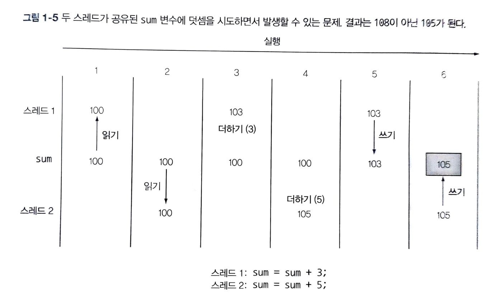

## 1.4 스트림

대부분 자바 애플리케이션은 컬렉션을 만들고 활용한다. 하지만 이는 항상 간단하지 않다. 다음은 리스트에서 고가의 트랜잭션만 필터링한 리스트를 만드는 코드이다.

```Java
 // 그룹화된 트랜잭션을 더할 Map 생성
Map<Currency, List<Transaction>> transactionsByCurrencies = new HashMap<>();
// 트랜잭션의 리스트를 반복
for (Transaction transcation : transactions) {
    // 고가의 트랜잭션을 필터링
    if (transaction.getPrice() > 1000) {
    // 트랜잭션의 통화 추출
    Currency currency = transaction.getCurrency();
    List<Transaction> transactionsForCurrency = transactionsByCurrencies.get(currency);
    // 현재 통화의 그룹화된 맵에 항목이 없으면 새로 만든다.
    if (transactionsForCurrency == null) {
        transactionsForCurrency = new ArrayList<>();
        transactionsByCurrencies.put(currency, transactionsForCurrency);
    }
    // 현재 탐색된 트랜잭션을 같은 통화의 트랜잭션 리스트에 추가한다.
    transactionsForCurrency.add(transaction);
    }
}
```

이 코드에는 중첩된 제어 흐름 문장이 많아 코드를 한 번에 이해하기도 어렵다.

스트림 API를 이용하면 간단하게 작성할 수 있다.

```Java

import static java.util.stream.Collectors.groupingBy;
Map<Currency, List<Transaction>> transactionsByCurrencies =
    transactions.stream()
        .filter((Transaction t) -> t.getPrice() > 1000) // 고가의 트랜잭션 필터링
        .collection(groupingBy(Transaction::getCurrency)); //통화로 그룹화함
```

스트림 API를 이용하면 컬렉션 API와는 다른 방식으로 데이터를 처리할 수 있다는 사실을 알 수 있다.

컬렉션에서는 for-each문을 이용하여 반복 과정을 직접 처리해야 했다. 이런 방식을 **외부 반복**이라고 한다. 반면 스트림에서는 라이브러리 내부에서 모든 데이터가 처리된다. 이를 **내부 반복**이라고 한다.

거대한 데이터를 컬렉션을 이용하여 처리하려면 단일 CPU로는 매우 오랜 시간이 걸릴 수 있다. 하지만 대부분의 컴퓨터는 멀티코어 컴퓨터이고 서로 다른 CPU 코어에 작업을 각각 할당해서 처리 시간을 줄일 수 있다. 자바에서는 **멀티스레딩** 코드를 구현해서 병렬성을 이용할 수 있지만 쉽지 않다.

### 멀티스레딩은 어렵다

멀티스레딩 환경에서 각각의 스레드는 동시에 공유된 데이터에 접근하고 갱신할 수 있다. 스레드를 잘 제어하지 못한다면 데이터가 예상치 못한 방식으로 변한다. 전통적으로 자바에서 멀티스레딩 환경에서는 synchronized를 자주 활용하였지만 많은 버그가 발생할 수 있다. 자바 8에서는 synchronized가 필요하지 않는 함수형 프로그래밍 형식의 스트림 기반 병렬성을 이용하도록 권고한다.

자바 8은 스트림 API로 '컬렉션을 처리하면서 발생하는 모호함과 반복적인 코드 문제', 그리고 '멀티코어 활용의 어려움'이라는 두 가지 문제를 모두 해결하였다. 기존의 컬렉션에서는 데이터를 처리할 때 반복되는 패턴이 너무 많았다. 여기서 말하는 반복되는 패턴은 **조건에 따른 데이터 필터링**, **데이터 추출**, **데이터 그룹화** 등을 의미한다. 이러한 동작들을 쉽게 병렬화할 수 있다.

컬렉션을 필터링할 수 있는 가장 빠르고 효율적인 방법은

1. 컬렉션을 스트림으로 바꾸고
2. 병렬로 처리한 다음
3. 컬렉션으로 다시 복원하는 것이다.

무거운 사과를 순차 처리 또는 병렬 처리로 필터링하는 코드는 다음과 같다.

#### 순차 처리 방식

```Java
import static java.util.stream.Collectors.toList;
List<Apple> heavyApples =
	inventory.stream().filter((Apple a) -> a.getWeight() > 150)
	                  .collect(toList());
```

#### 병렬 처리 방식

```Java
import static java.util.stream.Collectors.toList;
List<Apple> heavyApples =
	inventory.parallelStream().filter((Apple a) -> a.getWeight() > 150)
	                  .collect(toList());
```

> ArrayList와 같은 순차적인 자료구조는 내부적으로 인덱스를 사용하여 요소들에 접근하기 때문에 병렬 처리에 적합하지 않는다.
> 따라서, 병렬 처리를 지원하는 자료구조를 사용해야 한다.
> 병렬 처리가 항상 순차 처리보다 빠른 것은 아니므로, 성능 최적화를 위해서는 실제 데이터에 대한 측정과 분석이 필요하다.
